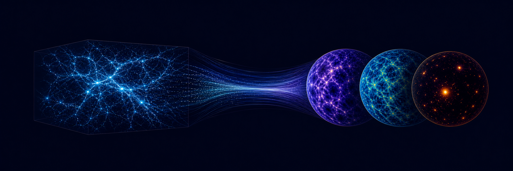

<p align="center">
  
</p>

<h1 align="center">LSS Forward Model</h1>

<p align="center">
  <strong>An end-to-end pipeline for transforming cosmological simulations into realistic survey observables.</strong>
</p>

<p align="center">
  <a href="https://www.python.org/"></a>
  
  
  
</p>

## Overview

**LSS Forward Model** is a modular, HPC-oriented pipeline that connects cosmological N-body simulations to both idealized cosmological fields and realistic survey mocks. It separates the problem into two stages: a physical forward model that produces noiseless full-sky observables, and a survey-realism layer that adds the geometry, sampling, noise, and calibration effects needed for data-like analyses.

The pipeline was developed for simulation-based cosmological inference and has workflows for Gower Street 2.0, CosmoGrid, Flamingo, and FS2 simulations, together with DES-, DECADE-, and Euclid-like WL mock generation. Its internal interfaces can be generalized to other simulations that provide compatible matter shells, cosmological metadata, and, for baryonic observables, halo lightcone catalogs.

> [!NOTE]
> This is active research software intended primarily for collaboration-scale and HPC workflows. Interfaces may evolve between scientific releases.

## What the pipeline does

### 1. N-body simulations → noiseless cosmological fields

Given matter-density shells and their cosmological/lightcone metadata, the pipeline can produce:

- Full-sky projected matter-density fields
- Weak-lensing convergence and shear in the Born approximation
- CMB-lensing convergence in the Born approximation
- Tomographic lensing maps for user-provided source redshift distributions
- Gaussian completion of missing high-redshift shells when required

If a compatible halo lightcone catalog is also available, it can additionally produce:

- Baryonified matter-density shells using BaryonForge
- Baryonified weak-lensing and CMB-lensing fields
- Full-sky, noiseless thermal Sunyaev–Zeldovich (Compton-y) maps

### 2. Noiseless fields → survey-realistic mocks

The survey layer generates DES-, DECADE-, and Euclid-like weak-lensing maps and catalogs, with support for:

- Survey footprints and masks
- Shape noise and catalog sampling
- Source clustering
- Intrinsic alignments
- Photometric-redshift distributions and redshift biases
- Multiplicative shear-calibration biases
- Tomographic source selections

These two layers allow the same underlying realization to generate physically consistent multi-probe observables and multiple survey configurations.

## Technical capabilities

- Process N-body lightcones and construct HEALPix density shells
- Build and manipulate halo lightcone catalogs
- Generate weak-lensing shear and convergence maps and mock source catalogs
- Model intrinsic alignments and source-clustering effects
- Propagate photometric-redshift and shear-calibration uncertainties
- Apply map-level baryonification and paint thermal SZ observables
- Generate galaxy-density and CMB-lensing fields
- Produce correlated, multi-probe realizations for simulation-based inference


## From simulations to survey observables

```text
N-body simulations
       │
       ├── density shells ────────┬── weak lensing / convergence
       │                          ├── intrinsic alignments
       ├── halo lightcones ───────┼── galaxies and source catalogs
       │                          ├── baryonified matter
       └── cosmological metadata ─┴── thermal SZ / CMB lensing
                                      │
                                      ▼
                         survey masks and systematics
                                      │
                                      ▼
                     realistic multi-probe mock realizations
```

## Installation

The recommended installation uses Conda because compiled cosmology packages such as CCL, CAMB, and healpy are substantially easier to reproduce through conda-forge. A reduced environment is provided in `environment.yml`.

```bash
git clone https://github.com/mgatti29/LSS_forward_model.git
cd LSS_forward_model

# Tested portable baseline
conda env create -f environment.yml
conda activate lss-forward-model

python -m pip install -e .
```

> [!IMPORTANT]
> Exact add-ons depend on the simulation suite, observables, and survey workflow. See `DEPENDENCIES.md` for the dependency audit and current portability limitations.

## Getting started

The `Examples/` directory contains notebooks for several simulations and science cases:

| Example | Purpose |
|---|---|
| `Examples/Tutorial.ipynb` | Recommended introductory workflow |
| `Examples/Cosmogrid.ipynb` | CosmoGrid processing |
| `Examples/Flamingo.ipynb` | FLAMINGO workflows |
| `Examples/Forward_model_DES.ipynb` | DES-like forward modeling |
| `Examples/Forward_model_Euclid.ipynb` | Euclid-like forward modeling |
| `Examples/baryonforge_test.ipynb` | Baryonification example |

Before advertising the tutorial as a quickstart, it should be tested once in a clean environment and annotated with expected runtime and memory requirements.

## Package structure

| Module | Scope |
|---|---|
| `cosmology` | Cosmological parameters, distances, shells, and simulation metadata |
| `halos` | Halo catalogs, coordinates, concentrations, and mass conversions |
| `maps` | Density shells, lensing fields, intrinsic alignments, baryonification, and tSZ |
| `lensing` | Weak-lensing samples, ellipticities, catalogs, and map I/O |
| `theory` | Limber-theory calculations |
| `PKDGRAV_and_postprocessing_utilities` | PKDGRAV output conversion and cleanup |


## Citation

If you use LSS Forward Model, please cite the software release and the relevant scientific methodology papers [Gatti et al. in prep.].

**TODO before publishing:** add the preferred software citation, associated papers, and a `CITATION.cff` file. A Zenodo archive can provide a versioned DOI for application and publication records.

## Contributing and support

This pipeline is developed in collaboration with researchers working on cosmological simulations and survey inference. Bug reports and focused contributions are welcome through GitHub Issues.

For scientific collaborations or questions, contact **Marco Gatti** at **marcogatti29@gmail.com**.

## License

LSS Forward Model is distributed under the [MIT License](LICENSE).
